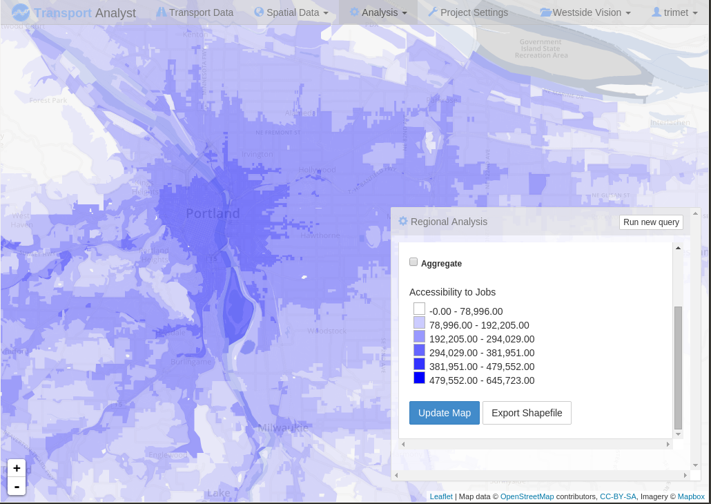

# Analyst Server

Analyst Server is a graphical user interface-driven, web-based tool for accessibility analysis of transportation networks:

Its current focus is on public transportation systems, but that is not a design goal; that is simply what has been implemented
so far. It allows the user to upload a representation of a transit network (real or hypothetical) and perform analysis
against it almost immediately.

## Installation

First, clone the repository locally. The only external dependency is a copy of [Play](http://www.playframework.com) and
a [vanilla extract](https://github.com/conveyal/vanilla-extract.git) server, which may be local or remote; configure its
URL in conf/application.conf. First copy conf/application.conf.template to conf/application.conf and edit the file following
the instructions in the comments.

Start the program by typing `activator run -mem <large number>`. The number is in megabytes, and should be as much as
you can spare; I typically use 8GB (8192), although you should be able to get by with less. Create the first user by going to http://localhost:9000/createUser?username=...&password=...&email=...
The application requires Java 8; make sure you have it installed, and set JAVA_HOME appropriately.

Finally, browse to [http://localhost:9000](http://localhost:9000) to log in and start the tutorial.

### Configuring remote computation

It is possible to offload many-to-many accessibility queries off to many machines. This relies on [otpa-cluster](https://github.com/conveyal/otpa-cluster/)
and Akka message passing. To pull this off, edit `application.conf` and set `cluster.work-offline` to false. This functionality is optional;
if you set `cluster.work-offline` to true, all computation will performed locally.

Cluster uses S3 buckets to pass data. Create a bucket for graphs and another for point sets. Put S3 credentials somewhere
and configure `cluster.s3credentials`. Finally, uncomment the cluster.akka section in application.conf to allow remoting,
and configure the port and bind address to allow the worker servers to connect.

Clone [otpa-cluster](https://github.com/conveyal/otpa-cluster) and build it with `gradle shadowJar`. Start up the jar
like so, on the worker machines:

    java -Xmx4G -Dotpac.bucket.pointsets=<POINTSETS BUCKET> -Dotpac.bucket.graphs=<GRAPHS BUCKET> -Ds3.credentials.filename=<S3 CREDENTIALS FILENAME> -jar build/libs/otpa-cluster-all.jar -w akka.tcp://analyst-server@<server>:<port>/user/executive

Repeat as desired.

If you want to do single-point scenario comparisons, it is recommended that you start at least two cluster workers. If you have sufficient memory, it is possible to run these on the same machine; simply specify `-Dakka.remote.netty.tcp.port=<free port>` for each one.

#### Securing cluster

You can add a secure cookie for [Akka remoting](http://doc.akka.io/docs/akka/snapshot/scala/remoting.html). Uncomment the
secure cookie lines in application.conf, then pass in `-Dakka.remote.secure-cookie=COOKIE -Dakka.remote.require-cookie=on` when you start the worker.
